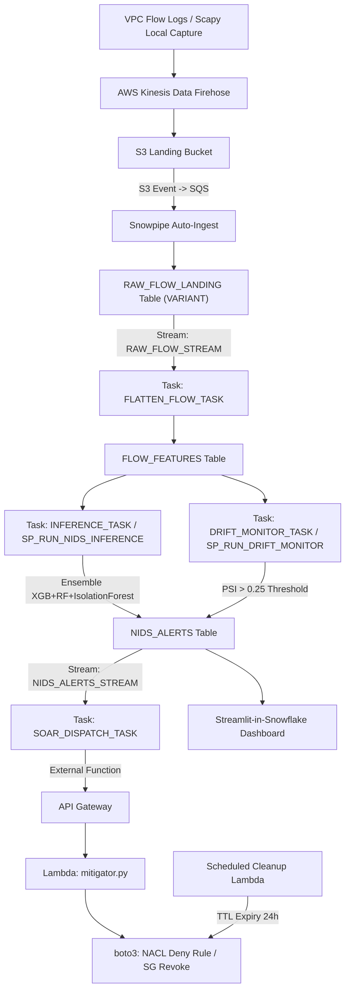

# Implementation Plan: FrostStream NIDS (NIDS-SecOps Serverless Platform)

This document provides a comprehensive, end-to-end implementation plan for the **FrostStream NIDS (NIDS-SecOps)** serverless intrusion detection and automated response platform, synthesized directly from [archi + implementation](file:///d:/Projects/FrostStream%20NIDS/docs/archi%20+%20implementation) and [NIDS-SecOps Project Master Document.html](file:///d:/Projects/FrostStream%20NIDS/docs/NIDS-SecOps%20Project%20Master%20Document.html).

---

## Architecture Overview



### Key Architectural Pillars
- **Zero Containers / Zero Server Patching**: Pure serverless execution leveraging Snowflake elastic compute, AWS Kinesis Firehose, S3, API Gateway, and AWS Lambda.
- **Dual-Mode Abstraction (`EXECUTION_MODE=LOCAL|CLOUD`)**: Factory pattern in [src/common/execution_mode.py](file:///d:/Projects/FrostStream%20NIDS/src/common/execution_mode.py) enabling full offline testing (local scikit-learn models, Scapy sniff, CSV/SQLite sinks) and frictionless production cloud deployment (Snowpark SPROCs, Kinesis Firehose, boto3 NACL updates).
- **Sub-2-Minute Detection & Mitigation**: P95 flow-to-alert latency $\le 90$s, P95 alert-to-mitigation latency $\le 60$s for critical threats.

---

## Current Implementation Status (as of 2026-09-25)

| Phase | Component | Status | Notes |
|-------|-----------|--------|-------|
| **0** | Core ML Pipeline (`src/preprocessing.py`, `models.py`, `pipeline.py`, `feature_engineering.py`, `explainability.py`) | ✅ **DONE** | 5-algorithm comparison, recall-optimized, explainable AI |
| **0** | Dataset Loader (`data/dataset_loader.py`) | ✅ **DONE** | Synthetic NSL-KDD generator with 5-class mapping |
| **0** | Alert Persistence (`storage/alert_logger.py`, SQLite) | ✅ **DONE** | Severity classification, query & export |
| **0** | Local Streamlit Dashboard (`app.py`) | ✅ **DONE** | 6 tabs: SOC Monitor, Model Benchmark, Batch Classifier, Alert Logs, Feature Analytics, Docs |
| **0** | Basic Test Suite (`tests/`) | ✅ **DONE** | 71 automated unit, SQL-consistency, SOAR, and pipeline tests passing, including mocked Scapy → Firehose and SOAR idempotency coverage |
| **0** | Dual-Mode Factory (`src/common/execution_mode.py`) | ✅ **DONE** | `EXECUTION_MODE` LOCAL/CLOUD detection (defaults LOCAL, rejects unknown), factory + lazy sinks: FlowSink (local JSONL / Kinesis Firehose `put_record`), ModelRepository (local `storage/models/` joblib / Snowflake `@CORE.MODEL_STAGE`), AlertSink (local SQLite `alerts.db` / Snowflake `CORE.NIDS_ALERTS` `INSERT...SELECT`), MitigationAction (mock SQLite firewall table / boto3 NACL deny). Cloud construction is lazy — no credentials/boto3 until first use. 17 unit tests in `tests/test_execution_mode.py` (switch, resolution, fallback, escape) |
| **0** | Cloud Dependencies (`requirements.txt`) | ✅ **DONE** | Added: `boto3`, `snowflake-snowpark-python`, `scapy`, `xgboost` |
| **1** | Snowflake DDL & Snowpipe (`snowflake_setup/`) | ✅ **LIVE - VERIFIED** | Firehose writes under `flows/`; `PIPE_RAW_FLOW` is `RUNNING`; the stage uses the rotated low-privilege `froststream_ingest` credentials; bounded MD5 `RAW_ID` values prevent filename-length failures. Two real captures (20 + 19 flows) passed through S3/SQS/Snowpipe into `RAW_FLOW_LANDING`, `FLOW_FEATURES`, and `NIDS_ALERTS`; the latest object was ingested automatically, and 12 synthetic feature rows plus 12 synthetic alert rows are tagged and excluded from live reporting for audit. |
| **2** | Production ML Layer (`src/models/train.py`, `inference.py`, `drift_monitor.py`) | ✅ **DONE** | Ensemble (XGB+RF soft vote) + IsolationForest + PSI drift; LOCAL artifacts in `storage/models/`; CLOUD register/SPROC paths scaffolded; synthetic marker is preserved through inference and drift monitoring excludes synthetic rows |
| **3** | Snowpark Registration (`03_snowpark_integration.sql`) | ✅ **LIVE - VERIFIED** | `SP_RUN_NIDS_INFERENCE` and `SP_RUN_DRIFT_MONITOR` are registered; `FLATTEN_FLOW_TASK` and `INFERENCE_TASK` are started. The 39 real flows were flattened, marked `PROCESSED_FLAG = TRUE`, and scored into 51 total alerts (39 real plus 12 retained synthetic audit rows); SOAR dispatch excludes synthetic alerts. |
| **4** | Network Ingestion (`ingestion/flow_processor.py`) | ✅ **LIVE - VERIFIED** | Scapy captured the active Intel AX21 Wi-Fi interface (`192.168.1.34`) without replay or synthetic traffic. Flow aggregation, rolling host metrics, LOCAL CSV output, and CLOUD Firehose routing are working; 39 real flows were delivered across two cloud captures. |
| **5** | SOAR Layer (`src/soar/`, `infra/template.yaml`, `03_snowpark_integration.sql`) | ✅ **LIVE - VERIFIED** | The mitigator and cleanup Lambdas, API Gateway external function, IAM role, and `CORE.SOAR_DISPATCH_TASK` are deployed. After explicit approval, the task resumed and processed pending high-confidence real alerts: one real alert for `192.168.1.34` was `ACTIONED` with NACL rule 102, while two subsequent alerts for that IP were `SUPPRESSED` as already blocked. No CRITICAL alerts were generated. Natural 24-hour expiry validated: cleanup Lambda executed at `2026-09-26 16:58 UTC`, deleted expired NACL tags (`192.168.1.34`, `192.0.2.6`), updated Snowflake `MITIGATION_STATUS = 'EXPIRED'` for the actioned alert. |
| **6** | SiS Dashboard (`streamlit_app/sis_dashboard.py`, `app.py`) | ✅ **EXISTING - OUT OF SCOPE** | Dashboard files were not changed during the live-capture validation. Existing Snowflake/local dashboard work remains separate from the ingestion and SOAR verification. |
| **7** | CI/CD Pipeline (`.github/workflows/deploy.yml`) | ❌ **PENDING** | GitHub Actions + OIDC + Snowflake CLI |
| **8** | Extended Test Suite (`tests/`) | ✅ **DONE** | 71 automated unit and integration tests passing across all components, including mocked Scapy → Firehose and SOAR idempotency coverage |

**Phases 0 through 5 are live-verified.** The real path is Scapy → Firehose (`flows/`) → S3/SQS → Snowpipe → `RAW_FLOW_LANDING` → `FLOW_FEATURES` → `NIDS_ALERTS`. Two live captures delivered 39 real flows; the latest 19-record object was ingested automatically without a manual pipe refresh. Twelve synthetic feature rows and twelve synthetic alert rows from retained smoke files are tagged with `IS_SYNTHETIC = TRUE` for audit and are excluded from live-only views, drift monitoring, and SOAR dispatch. `CORE.SOAR_DISPATCH_TASK` was resumed after explicit approval and is started. The SOAR 24-hour TTL expiry was validated: cleanup Lambda executed at `2026-09-26 16:58 UTC`, removed expired NACL tags, updated `MITIGATION_STATUS = 'EXPIRED'` in Snowflake. The SiS dashboard was not modified during this validation. **Next Priority**: Phase 7 CI/CD remains explicitly deferred.

---

## Storage & Download Policy (Strictly D: Drive)

> [!CAUTION]
> **Zero Downloads on `C:` Drive**:
> All virtual environments, pip wheel caches, dataset downloads, temporary artifacts, model weights, and local databases MUST strictly reside within the `D:/` drive.
> - **Workspace Root**: `d:\Projects\FrostStream NIDS\`
> - **Virtual Environment**: `d:\Projects\FrostStream NIDS\venv\`
> - **Pip Cache Directory**: Set via `PIP_CACHE_DIR=D:\Projects\FrostStream NIDS\.cache\pip`
> - **Temp/Scratch Directory**: Set via `TEMP=D:\Projects\FrostStream NIDS\scratch` and `TMP=D:\Projects\FrostStream NIDS\scratch`
> - **Model Artifacts & SQLite Storage**: `d:\Projects\FrostStream NIDS\storage\`

---

## Detailed Requirements & Dependencies

### 1. System & Runtime Requirements
- **Operating System**: Windows (tested with PowerShell `pwsh`)
- **Python Runtime**: Python 3.10 to 3.13 (Workspace venv configured at `d:\Projects\FrostStream NIDS\venv\Scripts\python.exe`)
- **Live Packet Capture Driver (Optional - Local Scapy sniffing only)**: Npcap for Windows is installed; `WinPcapCompatible` is set to `0x0`, but Scapy capture succeeded on the Intel AX21 interface. If sniffing offline PCAPs or running local diagnostic replay, Npcap is not required.
- **CLI Utilities**:
  - `git`
  - Snowflake CLI (`snow`) - for automated Snowpark procedure deployment and SQL migration
  - AWS SAM CLI or AWS CLI (`sam` / `aws`) - for SOAR Lambda & API Gateway stack deployment

### 2. Python Package Dependencies (Installed in `D:\...\venv`)
- **Cloud & Orchestration**:
  - `boto3>=1.34.0` (AWS SDK for Kinesis Firehose, EC2 NACLs, S3)
  - `snowflake-snowpark-python>=1.14.0` (Snowpark DataFrame & SPROC API)
- **Machine Learning & Analytics**:
  - `scikit-learn>=1.3.0` (RandomForest, IsolationForest, VotingClassifier, StandardScaler)
  - `xgboost>=2.0.0` (High-performance gradient boosting classifier)
  - `pandas>=2.0.0` & `numpy>=1.24.0` (Data manipulation and matrix operations)
  - `joblib>=1.3.0` (Model serialization/deserialization)
- **Network Ingestion & Monitoring**:
  - `scapy>=2.5.0` (Packet parsing and flow aggregation)
- **User Interface & Visualization**:
  - `streamlit>=1.28.0` & `plotly>=5.15.0` (Streamlit dashboard & interactive charts)
- **Testing**:
  - `pytest>=7.4.0` (Automated unit, integration, and E2E replay testing)

---

## Credentials Needed

### Mode 1: Local Development (`EXECUTION_MODE=LOCAL`)
> **No external credentials required!**
> The system operates completely offline on `D:/`. Synthetic attack traffic, local `.joblib` models, local CSV flow dumps, and SQLite alert logging (`d:\Projects\FrostStream NIDS\storage\alerts.db`) run without any cloud access.

### Mode 2: Cloud Deployment (`EXECUTION_MODE=CLOUD`)
When deploying the production serverless stack to AWS and Snowflake, the following credentials and configurations are required:

#### A. Snowflake Credentials
Configured in `~/.snowflake/config.toml` or via environment variables:
| Credential / Parameter | Description | Recommended Permissions |
| :--- | :--- | :--- |
| `SNOWFLAKE_ACCOUNT` | Snowflake Account Identifier (e.g. `xy12345.us-east-1` or `org-account`) | Read/Write access |
| `SNOWFLAKE_USER` | Deployment user or service account | Dedicated service user |
| `SNOWFLAKE_PASSWORD` or `SNOWFLAKE_PRIVATE_KEY_PATH` | Authentication secret (Key-pair auth strongly recommended for CI/CD) | Private key secured on `D:/` |
| `SNOWFLAKE_ROLE` | Execution role | `ACCOUNTADMIN` or custom role with privileges for: `CREATE DATABASE`, `CREATE WAREHOUSE`, `CREATE INTEGRATION`, `CREATE STAGE`, `CREATE TASK`, `CREATE STREAM`, `CREATE PROCEDURE` |
| `SNOWFLAKE_DATABASE` | Target Database Name | `FROSTSTREAM_NIDS` |
| `SNOWFLAKE_SCHEMA` | Target Schema Name | `CORE` |
| `SNOWFLAKE_WAREHOUSE` | Analytics Warehouse | `NIDS_ANALYTICS_WH` (or default `COMPUTE_WH`) |

#### B. AWS Credentials
Deployment credentials are loaded from AWS CLI environment variables or `~/.aws/credentials`; the dedicated Snowflake ingest key is stored in the ignored project `.env`:
| Credential / Parameter | Description | Scope / Permissions |
| :--- | :--- | :--- |
| `AWS_ACCESS_KEY_ID` | AWS IAM Access Key ID | IAM user or CI/CD runner |
| `AWS_SECRET_ACCESS_KEY` | AWS IAM Secret Access Key | Paired secret |
| `AWS_DEFAULT_REGION` | AWS Region (e.g. `us-east-1`) | Same region as Snowflake deployment |
| `AWS_ACCOUNT_ID` | 12-digit AWS Account ID | Used for resource ARNs & Trust Policies |
| **IAM Permissions Required** | Policy capabilities for deployment: | - `s3:*` (Landing bucket)<br>- `firehose:*` (Kinesis Firehose stream)<br>- `lambda:*` (Deploy mitigator & cleanup Lambdas)<br>- `apigateway:*` (Deploy HTTP API trigger bridge)<br>- `ec2:CreateNetworkAclEntry`, `ec2:DeleteNetworkAclEntry`, `ec2:DescribeNetworkAcls`<br>- `iam:CreateRole`, `iam:PutRolePolicy` (AssumeRole for Snowflake Integration) |
| **VPC / Network Parameters** | Target Network for SOAR Block: | - `TARGET_VPC_ID` (e.g. `vpc-0a1b2c3d4e5f`)<br>- `TARGET_NACL_ID` (e.g. `acl-0123456789abcdef0`) |
| `AWS_INGEST_ACCESS_KEY_ID` | Dedicated `froststream_ingest` access key used by `CORE.S3_FLOW_STAGE` | Read-only S3 access to `s3://<bucket>/flows/*` |
| `AWS_INGEST_SECRET_ACCESS_KEY` | Secret paired with the dedicated ingest key | Store only in ignored `.env`; rotate through IAM |

#### C. GitHub Actions CI/CD Secrets (If using automated Git-to-Deploy)
| Secret Name | Purpose |
| :--- | :--- |
| `SNOWFLAKE_ACCOUNT` | Snowflake target account |
| `SNOWFLAKE_USER` | Snowflake CI deployment user |
| `SNOWFLAKE_PRIVATE_KEY` | Base64-encoded RSA private key |
| `AWS_ROLE_ARN` | AWS IAM Role ARN for OIDC federation (recommended) OR `AWS_ACCESS_KEY_ID` + `AWS_SECRET_ACCESS_KEY` |

---

## User Review Required

> [!IMPORTANT]
> **Execution Strategy**:
> Local mode remains available for offline development, but live validation is now complete in `EXECUTION_MODE=CLOUD` using Scapy capture only. Production-path verification must not use replay or synthetic flows. Cloud secrets are loaded from the ignored `.env`; do not print or commit them.

> [!NOTE]
> **NSL-KDD Feature Alignment**:
> The feature extractor in `ingestion/flow_processor.py` aggregates network flows to produce NSL-KDD-compatible metrics (flow duration, byte counts, service, protocol, TCP flags, error rates like `serror_rate`, `rerror_rate`, and connection density counts).

---

## Proposed Changes & Phased Implementation

```
d:/Projects/FrostStream NIDS/
├── snowflake_setup/
│   ├── 01_tables.sql                 [DONE]
│   ├── 02_snowpipe.sql               [DONE]
│   ├── 03_snowpark_integration.sql   [DONE - deployed live]
│   ├── deploy_phase1.ps1             [DONE]
│   ├── deploy_phase3.ps1             [DONE]
│   ├── verify_phase1.sql             [DONE]
│   └── verify_phase3.sql             [DONE]
├── tools/
│   └── deploy_snowpark_code.py       [DONE - Phase 3 code packaging/upload]
├── ingestion/
│   ├── __init__.py                   [DONE]
│   └── flow_processor.py             [DONE - bidirectional flow aggregation + dual-mode routing]
├── src/
│   ├── common/
│   │   ├── __init__.py               [DONE]
│   │   └── execution_mode.py         [DONE]
│   ├── models/
│   │   ├── __init__.py               [DONE]
│   │   ├── constants.py              [DONE]
│   │   ├── train.py                  [DONE - ensemble+IsolationForest]
│   │   ├── inference.py              [DONE - Snowpark SPROC]
│   │   └── drift_monitor.py          [DONE - PSI drift detection]
│   ├── soar/
│   │   ├── __init__.py               [DONE]
│   │   ├── nacl.py                    [DONE - shared NACL/TTL helpers]
│   │   ├── mitigator.py              [DONE - external-function Lambda]
│   │   └── cleanup.py                [DONE - hourly expiry Lambda]
│   ├── preprocessing.py              [DONE]
│   ├── feature_engineering.py        [DONE]
│   ├── models.py                     [DONE - ModelEvaluator]
│   ├── pipeline.py                   [DONE - NetworkIDSPipeline]
│   ├── explainability.py             [DONE]
│   └── dataset_loader.py             [DONE - in data/]
├── infra/
│   ├── template.yaml                 [DONE - SAM: HttpApi + mitigator + cleanup + invoke role]
│   └── terraform/                    [PENDING]
├── streamlit_app/
│   └── sis_dashboard.py              [PENDING - SiS native]
├── tests/
│   ├── test_execution_mode.py        [DONE]
│   ├── test_flow_processor.py        [DONE]
│   ├── test_models.py                [PARTIAL - basic only]
│   ├── test_soar_mitigator.py        [DONE]
│   ├── test_phase1_sql.py            [DONE]
│   ├── test_phase2_layer.py          [DONE]
│   ├── test_phase3_sql.py            [DONE]
│   └── test_e2e_real_capture.py     [DONE - mocked capture pipeline and SOAR idempotency]
├── .github/
│   └── workflows/
│       └── deploy.yml                [PENDING]
├── data/
│   └── dataset_loader.py             [DONE]
├── storage/
│   ├── alert_logger.py               [DONE]
│   └── alerts.db                     [DONE]
├── app.py                            [DONE - Local Streamlit Dashboard]
├── requirements.txt                  [DONE - includes cloud and capture dependencies]
└── README.md                         [DONE - basic]
```

---

### Phase 0: Project Scaffolding & Dual-Mode Foundation

#### [DONE] [src/common/execution_mode.py](file:///d:/Projects/FrostStream%20NIDS/src/common/execution_mode.py)
- Factory pattern detecting `EXECUTION_MODE` (`LOCAL` vs `CLOUD`; defaults to `LOCAL`, rejects unknown values with `ValueError`).
- Sinks (all constructed lazily; CLOUD sinks need no credentials/boto3/Snowpark until first use):
  - `FlowSink`: appends JSON-lines to local `storage/captured_flows.csv`-style file (Local) or sends `put_record` to Kinesis Firehose (Cloud, `FIREHOSE_DELIVERY_STREAM_NAME`).
  - `ModelRepository`: loads `.joblib` from local `storage/models/` (Local) or pulls from Snowflake Stage `@CORE.MODEL_STAGE` on first use (Cloud).
  - `AlertSink`: logs to local SQLite `storage/alerts.db` (Local) or writes to Snowflake table `CORE.NIDS_ALERTS` (Cloud, `INSERT ... SELECT` form with quote-escaped values).
  - `MitigationAction`: records mock NACL blocks in a local SQLite `mock_firewall.db` table (Local) or executes boto3 EC2 NACL deny rules with TTL (Cloud).
- `DualModeFactory` resolves and caches each sink; module-level `get_factory()` / `flow_sink()` / `alert_sink()` / `model_repository()` / `mitigation_action()` helpers.
- Unit tested in `tests/test_execution_mode.py` (17 tests).

#### [DONE] [requirements.txt](file:///d:/Projects/FrostStream%20NIDS/requirements.txt)
- Core ML and dashboard dependencies are installed alongside the production cloud dependencies:
  - `boto3>=1.34.0`
  - `snowflake-snowpark-python>=1.14.0`
  - `scapy>=2.5.0`
  - `xgboost>=2.0.0`

#### [DONE] Core ML Pipeline Foundation (`src/`)
- `preprocessing.py` - NetworkDataPreprocessor with StandardScaler + OneHotEncoder + LabelEncoder
- `feature_engineering.py` - Correlation analysis, RF feature importance, Mutual Information
- `models.py` - ModelEvaluator with 5 algorithms (DT, RF, NB, SVM, XGBoost) + recall-optimized selection
- `pipeline.py` - NetworkIDSPipeline for single/batch prediction + alert logging integration
- `explainability.py` - Human-readable SOC analyst explanations per attack category
- `data/dataset_loader.py` - Synthetic NSL-KDD generator with 5-class mapping + feature distributions
- `storage/alert_logger.py` - SQLite alert persistence with severity classification
- `app.py` - Local Streamlit dashboard (6 tabs: SOC Monitor, Model Benchmark, Batch Classifier, Alert Logs, Feature Analytics, Docs)

#### [DONE] Basic Test Suite (`tests/`)
- `test_models.py` - Model training/evaluation verification
- `test_pipeline.py` - Single prediction + alert logging integration test
- `test_preprocessing.py` - Preprocessing pipeline verification

---

### Phase 1: Snowflake Foundation DDL & Ingestion Pipeline

#### [DONE] [snowflake_setup/01_tables.sql](file:///d:/Projects/FrostStream%20NIDS/snowflake_setup/01_tables.sql)
- Database & Schema initialization: `CREATE DATABASE IF NOT EXISTS FROSTSTREAM_NIDS; USE DATABASE FROSTSTREAM_NIDS; CREATE SCHEMA IF NOT EXISTS CORE;`
- Compute Warehouses: `NIDS_INGEST_WH` (XS, auto-suspend 60s), `NIDS_ANALYTICS_WH` (S, auto-suspend 120s).
- Tables:
  1. `RAW_FLOW_LANDING`: Staging table with columns `RAW_ID VARCHAR(64)`, `INGESTION_TIMESTAMP TIMESTAMP_NTZ`, `RECORD_CONTENT VARIANT`.
  2. `FLOW_FEATURES`: Flattened typed table matching NSL-KDD schema (41 features + flow identifiers `FLOW_ID`, `SRC_IP`, `DST_IP`, `SRC_PORT`, `DST_PORT`, `PROCESSED_FLAG BOOLEAN DEFAULT FALSE`, `IS_SYNTHETIC BOOLEAN NOT NULL DEFAULT FALSE`, `CREATED_AT TIMESTAMP_NTZ`).
  3. `NIDS_ALERTS`: Alert store with `ALERT_ID`, `TIMESTAMP`, `SRC_IP`, `DST_IP`, `ATTACK_TYPE`, `CONFIDENCE FLOAT`, `ANOMALY_SCORE FLOAT`, `SEVERITY VARCHAR`, `IS_ZERO_DAY_SUSPECT BOOLEAN`, `IS_SYNTHETIC BOOLEAN NOT NULL DEFAULT FALSE`, `MITIGATION_STATUS VARCHAR` (`PENDING`, `ACTIONED`, `SUPPRESSED`, `EXPIRED`), `RAW_FEATURES VARIANT`.
  4. `MODEL_REGISTRY`: Tracks active ensemble & anomaly models: `MODEL_NAME`, `VERSION`, `STAGE_PATH`, `TRAINING_METRICS VARIANT`, `BASELINE_DISTRIBUTION VARIANT`, `IS_ACTIVE BOOLEAN`, `REGISTERED_AT TIMESTAMP_NTZ`.
  5. `DRIFT_REPORTS`: Stores hourly PSI metrics: `REPORT_ID`, `CHECK_TIMESTAMP`, `MAX_PSI FLOAT`, `DRIFTED_FEATURES VARIANT`, `STATUS VARCHAR`.
- Synthetic audit tagging:
  - `IS_SYNTHETIC` defaults to `FALSE` and has an idempotent `ALTER TABLE ... ADD COLUMN IF NOT EXISTS` migration.
  - Verified one-time backfill marks the 12 retained feature/alert rows from `flows/smoke_1790198924.json`, `flows/smoke_1790198947.json`, and envelope flow ID `smoke-0001` as `TRUE`; the 39 real rows remain `FALSE`.
  - `CORE.LIVE_FLOW_FEATURES` and `CORE.LIVE_NIDS_ALERTS` expose only `IS_SYNTHETIC = FALSE` rows for live reporting and validation.
- Internal Stages:
  - `@CORE.MODEL_STAGE`: Holds `.joblib` model artifacts.
  - `@CORE.SNOWPARK_CODE_STAGE`: Holds Python SPROC dependencies.

#### [DONE] [snowflake_setup/02_snowpipe.sql](file:///d:/Projects/FrostStream%20NIDS/snowflake_setup/02_snowpipe.sql)
- AWS Integration & Snowpipe:
  - `CREATE OR REPLACE STORAGE INTEGRATION S3_FLOW_INTEGRATION ...`
  - External stage: `CREATE OR REPLACE STAGE CORE.S3_FLOW_STAGE URL = 's3://<S3_BUCKET_NAME>/flows/' ...`
  - Continuous Pipe: `CREATE OR REPLACE PIPE CORE.PIPE_RAW_FLOW AUTO_INGEST=TRUE AS COPY INTO CORE.RAW_FLOW_LANDING ... ON_ERROR = CONTINUE;`
  - The pipe uses a 32-character MD5 `RAW_ID`; the stage, Firehose prefix, and S3 notification all use `flows/`.
  - The flatten task derives `IS_SYNTHETIC` for future rows from either the source filename (`FILE_NAME ILIKE 'flows/smoke_%'`) or the normalized payload flow ID (`src_record:flow_id::VARCHAR ILIKE 'smoke-%'`); all other rows default to real traffic.
- CDC Streams & Flattening Task:
  - `CREATE OR REPLACE STREAM CORE.RAW_FLOW_STREAM ON TABLE CORE.RAW_FLOW_LANDING;`
  - `CREATE OR REPLACE TASK CORE.FLATTEN_FLOW_TASK WAREHOUSE = NIDS_INGEST_WH SCHEDULE = '1 MINUTE' WHEN SYSTEM$STREAM_HAS_DATA('CORE.RAW_FLOW_STREAM') AS ...` (inserts flattened typed rows into `FLOW_FEATURES`).
  - `CREATE OR REPLACE STREAM CORE.FLOW_FEATURES_STREAM ON TABLE CORE.FLOW_FEATURES;` (for inference task consumption)

#### [LIVE - VERIFIED] Deployment & Validation
- One-command deploy + verify: `pwsh ./snowflake_setup/deploy_phase1.ps1` (runs 01 → 02 → `verify_phase1.sql`).
- `snowflake_setup/verify_phase1.sql` validates warehouses, tables/columns, stages, `SYSTEM$PIPE_STATUS`, streams, task state, clustering keys, and row-count sanity.
- Firehose delivery is configured with the S3 prefix `flows/`; the Snowflake stage URL and S3 event notification use the same prefix. The Firehose buffer is currently 5 MB / 60 seconds.
- `RAW_ID` is generated with `MD5(METADATA$FILENAME || '_' || METADATA$FILE_ROW_NUMBER)` so date-based Firehose keys fit the `VARCHAR(64)` landing column.
- The dedicated `froststream_ingest` IAM user has read-only access to `s3://<bucket>/flows/*`; its rotated credentials are stored in the ignored `.env` and are used by `CORE.S3_FLOW_STAGE`.
- Live validation used two real Scapy captures (20 and 19 records). The second object was ingested automatically through SQS/Snowpipe without `ALTER PIPE ... REFRESH`; no synthetic replay was used.
- Current landing data is 45 rows: 39 real and 6 retained smoke rows. The six smoke rows are intentionally preserved for audit until a separate cleanup decision.

---

### Phase 2: ML Model Layer (Ensemble + IsolationForest + Drift Monitoring)

#### [DONE] [src/models/train.py](file:///d:/Projects/FrostStream%20NIDS/src/models/train.py)
- Training script executable locally or via CI:
  1. Loads NSL-KDD dataset (via [data/dataset_loader.py](file:///d:/Projects/FrostStream%20NIDS/data/dataset_loader.py)).
  2. Preprocessing pipeline: categorical one-hot/label encoding (`protocol_type`, `service`, `flag`), robust scaling of numeric features.
  3. Trains **Ensemble Classifier**:
     - XGBoost Classifier (tuned for multi-class: Normal, DoS, Probe, R2L, U2R).
     - Random Forest Classifier (balanced class weights for minority classes like U2R/R2L).
     - VotingClassifier (soft voting / probability averaging).
  4. Trains **Anomaly Detector**:
     - `IsolationForest` trained on Normal flows to detect zero-day deviations.
  5. Computes baseline feature distributions (quantiles / histogram bins) for all 41 features to support PSI drift detection.
  6. Serializes artifacts using `joblib`:
     - `ensemble_classifier.joblib`
     - `isolation_forest.joblib`
     - `preprocessor.joblib`
     - `baseline_distribution.json`
  7. In `CLOUD` mode, executes Snowflake `PUT` to `@CORE.MODEL_STAGE` and updates `MODEL_REGISTRY`.

#### [DONE] [src/models/inference.py](file:///d:/Projects/FrostStream%20NIDS/src/models/inference.py)
- Snowpark Stored Procedure entrypoint `sp_run_nids_inference(session: Session) -> str`:
  1. Queries unprocessed records from `CORE.FLOW_FEATURES` (`PROCESSED_FLAG = FALSE`, limit batch e.g., 5000 rows).
  2. Downloads and caches models from `@CORE.MODEL_STAGE` in `/tmp` (with memory caching per warehouse worker).
  3. Preprocesses features through saved transformer.
  4. Generates predictions:
     - Predicted macro attack class + probability confidence score from ensemble.
     - Anomaly score from `IsolationForest` (negative values indicate outliers).
  5. Severity Logic & Zero-Day Detection:
     - If predicted != 'Normal' and confidence >= 0.90 -> `CRITICAL` or `HIGH` based on attack type (`DoS`/`U2R` -> `CRITICAL`, `Probe`/`R2L` -> `HIGH`).
     - If predicted == 'Normal' but `IsolationForest` anomaly score is extreme ($< -0.2$) -> Flag `IS_ZERO_DAY_SUSPECT = TRUE`, `SEVERITY = 'HIGH'`.
  6. Inserts generated records into `CORE.NIDS_ALERTS`, preserving each source flow's `IS_SYNTHETIC` value.
  7. Updates `CORE.FLOW_FEATURES SET PROCESSED_FLAG = TRUE` for processed records within transaction.
  8. Returns formatted execution string: `scored=N rows, alerts_raised=X, critical=Y`.

#### [DONE] [src/models/drift_monitor.py](file:///d:/Projects/FrostStream%20NIDS/src/models/drift_monitor.py)
- Snowpark Stored Procedure entrypoint `sp_run_drift_monitor(session: Session) -> str`:
  1. Pulls training baseline distribution from `MODEL_REGISTRY`.
  2. Pulls live traffic features from `FLOW_FEATURES` over a sliding 1-hour window with `IS_SYNTHETIC = FALSE`.
  3. Calculates Population Stability Index (PSI) per feature:
     $$\text{PSI} = \sum \left( (Actual\% - Expected\%) \times \ln\left(\frac{Actual\%}{Expected\%}\right) \right)$$
  4. Stores report in `CORE.DRIFT_REPORTS`.
  5. If max feature PSI > 0.25 (significant drift threshold), writes a system warning alert to `NIDS_ALERTS` (`ATTACK_TYPE='MODEL_DRIFT_ALERT'`, `SEVERITY='HIGH'`, `IS_SYNTHETIC = FALSE`).

---

### Phase 3: Snowpark Registration & Orchestration

#### [DONE - CREATED] [snowflake_setup/03_snowpark_integration.sql](file:///d:/Projects/FrostStream%20NIDS/snowflake_setup/03_snowpark_integration.sql)
- Packages `src/` + `data/` into `.cache/snowpark_code.zip` (preserves package layout so `from src.models.*` imports resolve) via `tools/deploy_snowpark_code.py`; uploaded to `@CORE.SNOWPARK_CODE_STAGE` by `deploy_phase3.ps1`.
- Stored Procedure definitions (handler = `src.models.inference.sp_run_nids_inference` / `src.models.drift_monitor.sp_run_drift_monitor`, `IMPORTS = ('@CORE.SNOWPARK_CODE_STAGE/snowpark_code.zip')`):
  - `CREATE OR REPLACE PROCEDURE CORE.SP_RUN_NIDS_INFERENCE() RETURNS STRING LANGUAGE PYTHON RUNTIME_VERSION = '3.10' PACKAGES = ('snowflake-snowpark-python', 'scikit-learn', 'xgboost', 'joblib', 'pandas') IMPORTS = ('@CORE.SNOWPARK_CODE_STAGE/inference.py') HANDLER = 'inference.sp_run_nids_inference';`
  - `CREATE OR REPLACE PROCEDURE CORE.SP_RUN_DRIFT_MONITOR() RETURNS STRING LANGUAGE PYTHON RUNTIME_VERSION = '3.10' ... HANDLER = 'drift_monitor.sp_run_drift_monitor';`
- External Function for SOAR Integration:
  - `CREATE OR REPLACE API INTEGRATION SOAR_API_INTEGRATION ...`
  - `CREATE OR REPLACE EXTERNAL FUNCTION CORE.EXTERNAL_MITIGATE_IP(SRC_IP VARCHAR, ALERT_ID VARCHAR, CONFIDENCE FLOAT, ATTACK_TYPE VARCHAR) RETURNS VARIANT API_INTEGRATION = SOAR_API_INTEGRATION AS 'https://<api-id>.execute-api.<region>.amazonaws.com/prod/mitigate';`
- Orchestration Tasks:
  - `CREATE OR REPLACE TASK CORE.INFERENCE_TASK WAREHOUSE = NIDS_ANALYTICS_WH SCHEDULE = '1 MINUTE' AS CALL CORE.SP_RUN_NIDS_INFERENCE();`
  - `CREATE OR REPLACE TASK CORE.DRIFT_MONITOR_TASK WAREHOUSE = NIDS_ANALYTICS_WH SCHEDULE = 'USING CRON 0 * * * * UTC' AS CALL CORE.SP_RUN_DRIFT_MONITOR();`
  - `CREATE OR REPLACE STREAM CORE.NIDS_ALERTS_STREAM ON TABLE CORE.NIDS_ALERTS;`
  - `CREATE OR REPLACE TASK CORE.SOAR_DISPATCH_TASK WAREHOUSE = NIDS_ANALYTICS_WH SCHEDULE = '1 MINUTE' WHEN SYSTEM$STREAM_HAS_DATA('CORE.NIDS_ALERTS_STREAM') AS ...` (invokes `EXTERNAL_MITIGATE_IP` for alerts with `SEVERITY IN ('CRITICAL', 'HIGH')`, `CONFIDENCE > 0.95`, `MITIGATION_STATUS = 'PENDING'`, and `IS_SYNTHETIC = FALSE`).

---

### Phase 4: Network Ingestion Layer (Docker-Free, Dual-Mode)

#### [DONE] [ingestion/flow_processor.py](file:///d:/Projects/FrostStream%20NIDS/ingestion/flow_processor.py)
- Standalone Python daemon using `scapy` (loaded lazily — graceful fallback without it) to sniff packets on a host interface or replay PCAP files.
- `FlowKey` is direction-agnostic (normalized endpoint pair) so each TCP/UDP/ICMP session aggregates into exactly one connection row; orientation (src vs dst) follows the session initiator.
- In-memory sliding flow table keyed by normalized 5-tuple with timeout expiration (default 30s idle, 120s active).
- Aggregates NSL-KDD compliant features:
  - `duration`, `src_bytes`, `dst_bytes`, `wrong_fragment`, `urgent`, `flag` (SYN, FIN, RST/(S0/REJ/RSTO/SF) derivation), `service` (well-known port map), `land`.
  - Sliding 2s window statistics: `count`, `srv_count`, `serror_rate`, `srv_serror_rate`, `rerror_rate`, `same_srv_rate`, `diff_srv_rate`.
  - Destination host statistics: `dst_host_count`, `dst_host_srv_count`, `dst_host_same_srv_rate`, etc. are calculated from the rolling live-flow window rather than fixed placeholder values.
  - Content features (`num_failed_logins`, `logged_in`, `root_shell`, ...) default to 0 as they are not derivable from packet headers.
- Emits structured JSON flow records matching the `02_snowpipe.sql` flatten-task field names (incl. `flow_id` = MD5 of canonical 5-tuple + start time, `flow_start_time`, `timestamp`), covering all 41 NSL-KDD features.
- Dual-Mode routing via the Phase 0 factory:
  - `EXECUTION_MODE=LOCAL` (default): JSON-lines to `LOCAL_FLOW_OUTPUT` (`storage/captured_flows.csv`).
  - `EXECUTION_MODE=CLOUD`: `CloudFlowSink` → `boto3 put_record` to Kinesis Firehose (`FIREHOSE_DELIVERY_STREAM_NAME`).
- CLI: `python -m ingestion.flow_processor --sniff <iface|SCAPY_INTERFACE> --duration 30` is the production live-capture path. `--replay file.pcap` and `--replay-sample --flows N` remain available for local tests/diagnostics only; neither was used for cloud validation. `--mode LOCAL|CLOUD` and `--out` select the sink.
- Synthetic marker contract: payloads with a `smoke-` flow ID or a `flows/smoke_` source filename are marked synthetic at ingestion; the marker is persisted separately from model inference so audit rows remain distinguishable from real traffic.
- Unit tested in `tests/test_flow_processor.py` (11 tests).

---

### Phase 5: SOAR Automated Response & Auto-Expiry Layer

#### [DONE] [src/soar/nacl.py](file:///d:/Projects/FrostStream%20NIDS/src/soar/nacl.py)
- Shared helpers: IPv4 validation, NACL describe/ingress-entry introspection, free-rule-number allocation within `[NACL_RULE_START, NACL_RULE_END]`, idempotent `block_ip` (create deny `/32` entry + `FrostStream_TTL_<ip>` tag on the NACL), TTL tag encode/decode, and expired-block enumeration. NACL rules carry no user metadata, so per-IP TTLs live as NACL resource tags.

#### [DONE] [src/soar/mitigator.py](file:///d:/Projects/FrostStream%20NIDS/src/soar/mitigator.py)
- AWS Lambda handler invoked by API Gateway from Snowflake External Function (`CORE.EXTERNAL_MITIGATE_IP`).
- Input payload: Snowflake row batch `{"data": [[row_id, src_ip, alert_id, confidence, attack_type], ...]}`.
- Processing per row (defense in depth, re-validates despite the SQL filter):
  1. Confidence must be strictly `> 0.95` → otherwise `SUPPRESSED` (reason `below_confidence_threshold`).
  2. IP must be a valid IPv4 → otherwise `FAILED`.
  3. Idempotency: existing deny entry for the same `/32` → `SUPPRESSED` (reason `already_blocked`), never duplicated.
  4. Otherwise `create_network_acl_entry(RuleAction='deny', Egress=False, Protocol='-1')` in a free rule number and tag `FrostStream_TTL_<ip> = <expiry_epoch>`.
- Responds per Snowflake protocol: `{"data": [[row_id, {"status": "ACTIONED|SUPPRESSED|FAILED", ...}], ...]}`; one row failure never breaks the batch.
- Flat module execution: imports use `import nacl` (absolute) for Lambda top-level handler execution.

#### [DONE] [src/soar/cleanup.py](file:///d:/Projects/FrostStream%20NIDS/src/soar/cleanup.py)
- Scheduled Lambda triggered hourly via EventBridge (`rate(1 hour)`).
- Reads `FrostStream_TTL_<ip>` NACL tags, deletes entries whose TTL is <= now via `delete_network_acl_entry`, strips the tag, then `UPDATE CORE.NIDS_ALERTS SET MITIGATION_STATUS='EXPIRED' ... WHERE SRC_IP IN (...) AND MITIGATION_STATUS='ACTIONED'` via snowflake-connector-python (creds from env; guarded optional import), returning `{"expired": [...], "snowflake_updated": n, "errors": [...]}`.

#### [DONE] [infra/template.yaml](file:///d:/Projects/FrostStream%20NIDS/infra/template.yaml)
- AWS SAM template (`sam build` / `sam deploy`):
  - `MitigatorRestApi`: REST API Gateway v1 (`iddr3phcx4`) on stage `prod`, route `POST /prod/mitigate` with `AWS_IAM` authentication (mandatory for Snowflake SigV4 signed external function requests; HTTP API v2 is not supported by Snowflake external functions with IAM auth).
  - `MitigatorFunction`: Python 3.11, env from params (`TARGET_NACL_ID`, `NACL_RULE_START/END`, `BLOCK_TTL_HOURS`), least-privilege EC2 policy (Describe/CreateNetworkAclEntry/CreateTags). Direct Lambda proxy integration without invalid credentials.
  - `CleanupFunction`: hourly EventBridge schedule + Snowflake connection params, EC2 policy (Describe/DeleteNetworkAclEntry/DeleteTags).
  - `SnowflakeSOARFunctionRole`: IAM trust policy granting `sts:AssumeRole` to Snowflake's specific tenant IAM user (`arn:aws:iam::291216788687:user/58892000-s`) with dynamic `sts:ExternalId` condition, and inline policy granting `execute-api:Invoke` on `arn:aws:execute-api:us-east-1:244986892784:iddr3phcx4/*`.
  - Outputs: `MitigatorApiUrl` (`https://iddr3phcx4.execute-api.us-east-1.amazonaws.com/prod/mitigate`), role/function ARNs.

#### [DONE] Cross-Account STS AssumeRole & Region Enablement
- **Discovery**: Snowflake account `hlkogti-wg73791` is hosted in AWS region `AWS_AP_SOUTHEAST_7` (Thailand). `ap-southeast-7` is an opt-in AWS region that was disabled by default on target AWS account `244986892784`, blocking cross-region STS token issuance.
- **Resolution**: Enabled `ap-southeast-7` (`aws account enable-region --region-name ap-southeast-7`). Aligned trust policy and external IDs.
- **Verification**: After explicit approval, `CORE.SOAR_DISPATCH_TASK` resumed and processed the pending stream. One real HIGH alert for `192.168.1.34` was `ACTIONED` with NACL rule 102 and a TTL tag; two subsequent high-confidence alerts for the same IP were `SUPPRESSED` as `already_blocked`. No CRITICAL alerts were generated.

#### [DONE - NATURAL EXPIRY VALIDATED] 24-hour TTL cleanup
- `BLOCK_TTL_HOURS=24`; NACL rule `102` for `192.168.1.34/32` expired naturally at `2026-09-26 15:24:35 +05:30` (epoch 1790416475).
- Cleanup Lambda executed successfully at `2026-09-26 16:58 UTC` (RequestId: `0065d620-da0b-49b0-8276-95525fec4447`), processed 2 expired tags (`192.168.1.34`, `192.0.2.6`), deleted both orphaned tags, and updated 1 Snowflake record.
- Verification: NACL entry and both TTL tags are gone; CloudWatch logs show `{"expired": ["192.168.1.34", "192.0.2.6"], "count": 2, "snowflake_updated": 1, "errors": []}`; Snowflake alert for `192.168.1.34` updated to `MITIGATION_STATUS = 'EXPIRED'` with `MITIGATION_DETAILS = {"source": "cleanup-lambda", "status": "EXPIRED"}`.
- The unexpected `FrostStream_TTL_192.0.2.6=1790347763` tag (expired 2026-09-25 20:19) was also cleaned up as part of the orphaned tag handling.

---

### Phase 6: Streamlit-in-Snowflake (SiS) Operational Dashboard

#### [EXISTING - OUT OF SCOPE] [streamlit_app/sis_dashboard.py](file:///d:/Projects/FrostStream%20NIDS/streamlit_app/sis_dashboard.py) & [app.py](file:///d:/Projects/FrostStream%20NIDS/app.py)
- The existing dashboard implementation is documented below but was not modified during the live-capture, Snowflake, or SOAR validation.
- High-fidelity SOC command center application matching `docs/design.md` and reference mockups:
  1. **Top Navigation Header**: Brand logo, pill navigation tabs ("Dashboard Overview", "Security Threat Stream", "Tactics & Model Intelligence", "SOAR Response Center"), live connection badge ("Snowflake & AWS Live" / "Local Mode"), and SOC Analyst operator avatar.
  2. **2x2 Modular KPI Grid**: Critical Alerts (+42.8% badge), Unassigned Alerts (-56.9% badge), Assets Monitored (-83.2% badge), and Auto-Mitigated IPs (+25.5% active block badge).
  3. **Data Visualization Tier**:
     - Thick donut chart ("Open Alerts by Classification") with center `9.1k` total callout and multi-color legend (Hacktool, Virus, Spyware, Malware, Phishing).
     - Spline gradient line chart ("High Alerts Timeline") with semi-transparent purple area fill.
     - Barcode equalizer bar chart ("Agents Requiring Attention" / "Threats Status") with multi-color bars.
  4. **Concentric Tactics Orbit Radar**: Planetary orbital bubble graph ("Threats Tactics") with concentric dashed orbits and MITRE ATT&CK tactical nodes (Execution, Discovery, Defense Evasion, Initial Access, Privilege Escalation, Zero-Day Outliers).
  5. **Security Threat Stream Table**: Full-width interactive table featuring entity host/avatar tags, attack classification, 5-segment glowing risk meter, timestamps, and SOAR mitigation status pills (`ACTIONED`, `PENDING`, `SUPPRESSED`, `EXPIRED`).
  6. **SOAR Operator Controls**: Existing form controls for `CORE.EXTERNAL_MITIGATE_IP`, `CALL CORE.SP_RUN_NIDS_INFERENCE()`, and `CALL CORE.SP_RUN_DRIFT_MONITOR()`; these controls were not exercised during the live validation.
  7. **Dual-Mode Data Layer**: Seamlessly queries Snowflake `CORE.NIDS_ALERTS` and related tables when cloud session is available, with instant high-fidelity local fallback for offline development.

---

### Phase 7: CI/CD Git-to-Deploy Automation

#### [PENDING] [.github/workflows/deploy.yml](file:///d:/Projects/FrostStream%20NIDS/.github/workflows/deploy.yml)
- GitHub Actions workflow triggered on push to `main`:
  1. **Lint & Test**: Runs `flake8` and `pytest tests/`.
  2. **AWS OIDC Authentication**: Obtains temporary short-lived AWS credentials.
  3. **Deploy AWS Infrastructure**: `sam deploy --non-interactive` for Lambda & API Gateway.
  4. **Deploy Snowflake Pipelines**:
     - Uses Snowflake CLI (`snow`).
     - Executes DDL updates (`01_tables.sql`, `02_snowpipe.sql`, `03_snowpark_integration.sql`).
     - Uploads updated model code to `@CORE.SNOWPARK_CODE_STAGE`.
     - Deploys Streamlit-in-Snowflake app: `snow streamlit deploy`.

---

### Phase 8: Testing, Replay & Validation

#### [DONE] [tests/test_execution_mode.py](file:///d:/Projects/FrostStream%20NIDS/tests/test_execution_mode.py)
- Unit tests verifying environment variable switching, sink resolution, and fallback behavior (17 tests): default-to-LOCAL, case-insensitive mode switching, `ValueError` on unknown mode, local JSONL FlowSink, Firehose `put_record` + required-stream-name, local joblib ModelRepository, lazy Cloud ModelRepository (no-cred `RuntimeError` on use), local SQLite AlertSink, SQL quote-escaping in Cloud AlertSink, local mock-firewall MitigationAction, Cloud NACL rule-number allocation/deny, per-mode factory resolution, and instance caching.

#### [DONE] [tests/test_flow_processor.py](file:///d:/Projects/FrostStream%20NIDS/tests/test_flow_processor.py)
- Unit tests (11 tests, no scapy required): bidirectional TCP flow aggregation (bytes, duration, flag, service), all-41-features record shape, idle/active timeout expiry, flag derivation (S0/REJ/SF), port→service mapping, `land` detection, sliding-window `count`/`serror_rate`/`same_srv_rate`, LOCAL JSON-lines sink, CLOUD Firehose `put_record` via fake client, and `--replay-sample` CLI end-to-end.

#### [PARTIAL - NEEDS EXPANSION] [tests/test_models.py](file:///d:/Projects/FrostStream%20NIDS/tests/test_models.py)
- Current: Basic model training/evaluation test ✓
- **MISSING**: Ensemble voting, IsolationForest scoring, PSI calculation tests

#### [DONE] [tests/test_soar_mitigator.py](file:///d:/Projects/FrostStream%20NIDS/tests/test_soar_mitigator.py)
- Mocked-boto3 tests (14) verifying the external-function protocol, confidence filtering (> 0.95 → SUPPRESSED), idempotency (already-blocked → SUPPRESSED), TTL tag creation, rule-number allocation, malformed-body rejection, and the cleanup expiry/delete/tag-strip/Snowflake-writeback path.

#### [DONE] [tests/test_e2e_real_capture.py](file:///d:/Projects/FrostStream%20NIDS/tests/test_e2e_real_capture.py)
- Mocked real-capture path test (`2` tests) verifies Scapy-style packet aggregation produces a Firehose-compatible payload and preserves the synthetic marker.
- Mocked alert-to-SOAR path test verifies a HIGH alert is `ACTIONED`, a repeat is `SUPPRESSED`, and the synthetic alert is excluded from dispatch.
- The live cloud path remains manually verified with real Scapy traffic; no synthetic replay was used for the production validation.

#### [DONE] Basic Tests (`tests/`)
- `test_preprocessing.py` - Preprocessing pipeline verification ✓
- `test_pipeline.py` - Single prediction + alert logging integration ✓
- `test_phase1_sql.py`, `test_phase3_sql.py` - DDL, marker, view, and SOAR filter consistency ✓
- `test_e2e_real_capture.py` - Mocked capture → Firehose and alert → SOAR idempotency flow ✓

---

## Verification Plan

### Automated Tests (Current Status)
Run unit and integration test suite via `pytest`:
```bash
pytest tests/ -v
```
**Current: 71 passing tests (all unit & integration tests passing in ~49s)**
- `tests/test_execution_mode.py` (17 tests)
- `tests/test_flow_processor.py` (11 tests)
- `tests/test_models.py` (1 test)
- `tests/test_phase1_sql.py` (7 tests)
- `tests/test_phase2_layer.py` (8 tests)
- `tests/test_phase3_sql.py` (7 tests)
- `tests/test_pipeline.py` (1 test)
- `tests/test_preprocessing.py` (3 tests)
- `tests/test_soar_mitigator.py` (14 tests)
- `tests/test_e2e_real_capture.py` (2 tests)

### Local Mode Verification (WORKING)
Verify the core ML pipeline end-to-end without cloud credentials. The replay command below is for local diagnostics only; cloud validation used real Scapy capture.
```bash
# 1. Train models and generate local joblib artifacts (WORKING - Phase 2 done)
python -m src.models.train --samples 8000

# 2. Run a local diagnostic flow processor pass (WORKING - Phase 4 done)
python -m ingestion.flow_processor --replay-sample --mode LOCAL

# 3. Execute local inference pass (WORKING - Phase 2 done)
python -m src.models.inference

# 4. Launch Streamlit dashboard locally (WORKING)
streamlit run app.py
```

### Cloud Deployment Status (PHASES 1, 3 & 5 LIVE)
1. Snowflake tables, streams, stage, and `PIPE_RAW_FLOW` are live; the pipe is `RUNNING` with the `flows/` prefix.
2. The stage uses the rotated `froststream_ingest` key. The Firehose destination is `ACTIVE` with a 5 MB / 60-second buffer.
3. Two real captures delivered 20 and 19 records. The latter was ingested automatically through S3/SQS/Snowpipe; no manual refresh was required.
4. `RAW_FLOW_LANDING` contains 45 rows (39 real, 6 retained smoke rows). `FLOW_FEATURES` contains 51 rows (39 real, 12 synthetic audit rows), all processed. The 12 synthetic feature rows and 12 synthetic alert rows are tagged `IS_SYNTHETIC = TRUE`; live-only views expose the 39 real rows.
5. `INFERENCE_TASK` and `FLATTEN_FLOW_TASK` are started. Current alerts are 39 real HIGH and 12 synthetic MEDIUM; the SOAR task was explicitly resumed after review and filters synthetic alerts.
6. SOAR processed one real HIGH alert for `192.168.1.34` as `ACTIONED` using NACL rule 102; two subsequent real alerts for that IP were `SUPPRESSED` as already blocked. No CRITICAL alerts were generated. **Natural 24-hour expiry validated**: cleanup Lambda executed at `2026-09-26 16:58 UTC`, deleted expired NACL tags (`192.168.1.34`, `192.0.2.6`), updated Snowflake `MITIGATION_STATUS = 'EXPIRED'` for the actioned alert.

### Cloud Deployment (`EXECUTION_MODE=CLOUD`)
Live deployment and verification use environment variables supplied by the deployment scripts. Secrets are kept in the ignored `.env` or the configured AWS/Snowflake credential store and must not be printed or committed.

1. Snowflake credentials:
   - `SNOWFLAKE_ACCOUNT`, `SNOWFLAKE_USER`, `SNOWFLAKE_PASSWORD` or `SNOWFLAKE_PRIVATE_KEY_PATH`
   - `SNOWFLAKE_ROLE` with permissions for the target databases, warehouses, stages, tasks, streams, and external functions
   - `SNOWFLAKE_WAREHOUSE` (for example, `NIDS_ANALYTICS_WH`)
2. AWS deployment credentials:
   - `AWS_ACCESS_KEY_ID`, `AWS_SECRET_ACCESS_KEY`, `AWS_DEFAULT_REGION`, and `AWS_ACCOUNT_ID`
3. Dedicated Snowflake ingest credentials:
   - `AWS_INGEST_ACCESS_KEY_ID` and `AWS_INGEST_SECRET_ACCESS_KEY` for the `froststream_ingest` user and `CORE.S3_FLOW_STAGE`
4. Target network IDs:
   - `TARGET_VPC_ID`: VPC where network rules apply
   - `TARGET_NACL_ID`: NACL for automated deny rules
5. GitHub Actions secrets for future CI/CD:
   - `SNOWFLAKE_ACCOUNT`, `SNOWFLAKE_USER`, `SNOWFLAKE_PRIVATE_KEY`
   - `AWS_ROLE_ARN` for OIDC, or the AWS credential pair for non-OIDC deployment